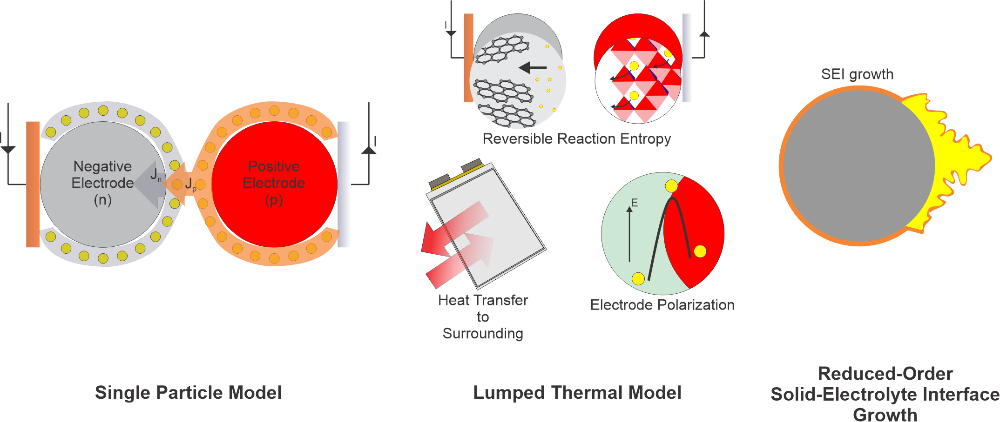

# Single Particle Model with Thermal and Degradation Models
#### Copyright© 2023 by Moin Ahmed. All rights reserved.

## Description

<p>
This repository contains the code for running single particle model with thermal and degradation models on 
Lithium-ion Batteries (LIB). Moreover, the repository contains the tools for visualization and 
parameter estimations (using genetic algorithm).
</p>
<p>
All the code is written in Python programming language, and it is written in a modular fashion. The code is
still an ongoing work and the documentation is not yet complete.
</p>

## Features

- <b>Single Particle Model with thermal (lumped thermal) and degradation (reduced-order SEI) models

- Parameter estimation using genetic algorithm

- Visualization tools</b>

## Directory Structure:
```examples``` - contains the example usage of this Python module.

```data``` - contains the datasets used in the examples.

```imgs``` - contains the images used in the documentations.

```SPPy``` - contains the source code.

## Solution Scheme
### Single Particle Model:
#### _Diffusion Equation Formulation:_
- Eigen Function Expansion [1]
- Two Term Polynomial (not yet implemented)
#### _Numerical Schemes:_
- ODE solvers (rk4)
### Thermal Models:
- Lumped Thermal Model
#### _Numerical Schemes:_
- ODE solvers (rk4)
### Degradation Models: (under construction)
- ROM - SEI growth [2]
#### _Numerical Schemes:_
- ODE solvers (Euler)
### References:
1. Guo, M., Sikha, G., & White, R. E. (2011). Single-Particle Model for a Lithium-Ion Cell: Thermal Behavior. Journal of The Electrochemical Society, 158(2), A122. https://doi.org/10.1149/1.3521314/XML
2. Randall, A. v., Perkins, R. D., Zhang, X., & Plett, G. L. (2012). Controls oriented reduced order modeling of solid-electrolyte interphase layer growth. Journal of Power Sources, 209, 282–288. https://doi.org/10.1016/J.JPOWSOUR.2012.02.114
