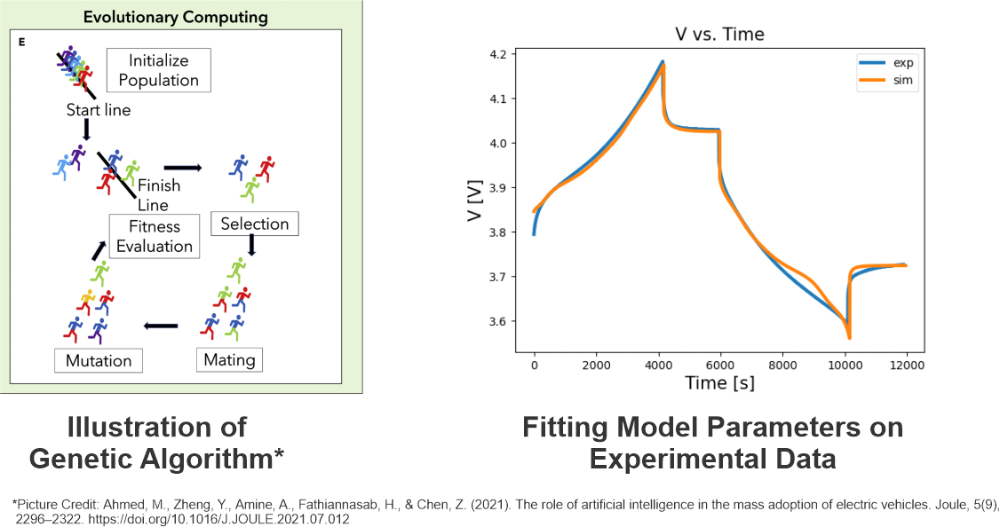

# Single Particle Model with Thermal and Degradation Models
#### Copyright© 2023 by Moin Ahmed. All rights reserved.

## Description

<p>
This repository contains the code for running single particle model with thermal and degradation models on 
Lithium-ion Batteries (LIB). Moreover, the repository contains the tools for visualization and 
parameter estimations (using genetic algorithm).
</p>
<p>
All the code is written in Python programming language, and it is written in a modular fashion. The code is
still an ongoing work and the documentation is not yet complete.
</p>

## Features

- <b>Single Particle Model with thermal (lumped thermal) and degradation (reduced-order SEI) models

- Parameter estimation using genetic algorithm

- Visualization tools</b>

## Installation

Either of the two recommended installation procedures can be used and the steps for these 
installation procedures are listed below.

### Git Clone

1. Install external python package dependencies required for this repository. The required dependencies are:
   - numpy
   - pandas
   - matplotlib
   - scipy
   - tqdm
2. Clone the repository, for example using git clone git@github.com:m0in92/EV_sim.git using Git Bash.

### Python setup
1. Download or clone this repository 
2. Ensure you are on the repository directory (where the setup.py resides) and run python setup.py sdist on the command line.
3. Step 2 will create a dist directory in the repository. Extract the contents tar.gz file in this directory. Move to 
the directory where the extracted files reside and run pip install EV_sim on the command line. This will install EV_sim
on your system (along with the external dependencies) and EV_sim can be imported as any other Python package.

## Usage

Example usage are included in the SPPy/examples folder.

## Directory Structure:

```parameter_sets``` - contains the datasets used in the examples.

```Assests``` - contains the images used in the documentations.

```SPPy``` - contains the source code. Some of the subdirectories include:
- ```examples``` - contains the example usage under various simulation conditions.


```tests``` - test files for this repository


## Solution Scheme
### Single Particle Model:
#### _Diffusion Equation Formulation:_
- Eigen Function Expansion [1]
- Two Term Polynomial (not yet implemented)
#### _Numerical Schemes:_
- ODE solvers (rk4)
### Thermal Models:
- Lumped Thermal Model
#### _Numerical Schemes:_
- ODE solvers (rk4)
### Degradation Models:
- ROM - SEI growth [2]
#### _Numerical Schemes:_
- ODE solvers (Euler)
### References:
1. Guo, M., Sikha, G., & White, R. E. (2011). Single-Particle Model for a Lithium-Ion Cell: Thermal Behavior. Journal of The Electrochemical Society, 158(2), A122. https://doi.org/10.1149/1.3521314/XML
2. Randall, A. v., Perkins, R. D., Zhang, X., & Plett, G. L. (2012). Controls oriented reduced order modeling of solid-electrolyte interphase layer growth. Journal of Power Sources, 209, 282–288. https://doi.org/10.1016/J.JPOWSOUR.2012.02.114
