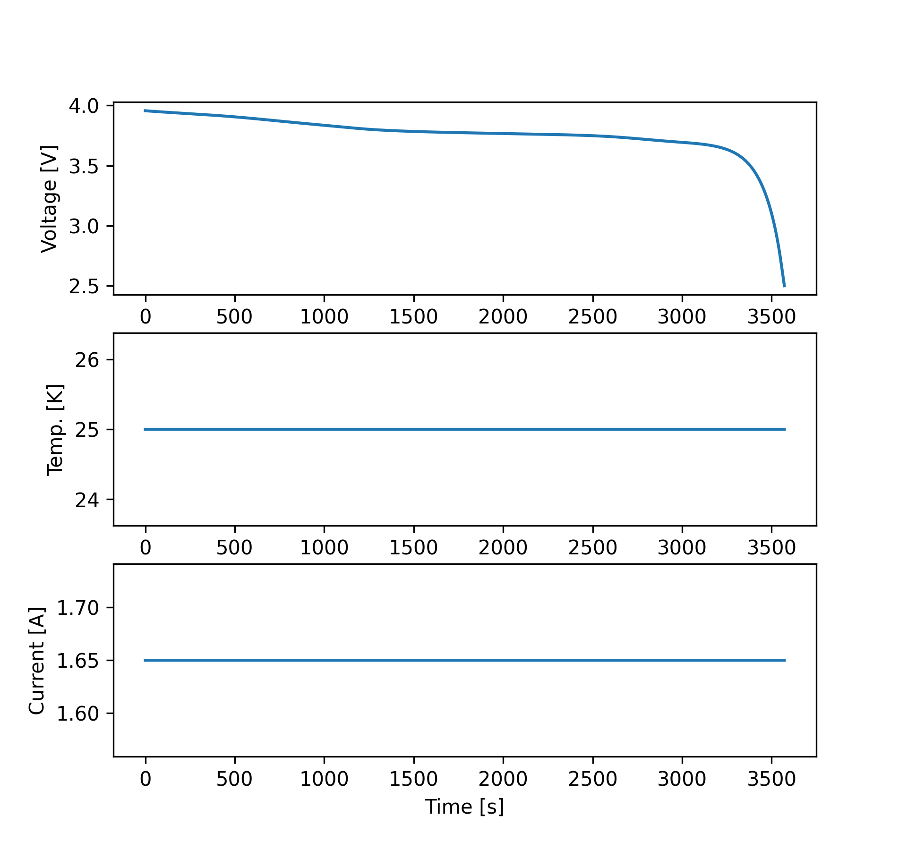

==================================================================
Example - Equivalent Circuit Model - Isothermal - Discharge Cycle
==================================================================

The following code demonstrates the simulation using the discrete time equivalent circuit model (ECM) under isothermal
conditions. Note that the user has to define the function representing the open-circuit potential (OCV) in the
``func_OCV`` parameters. Also, the parameters ``func_dOCVdT`` can be set to ``None`` as it is not utilized for
isothermal conditions.::

    # Simulation Parameters
    I = 1.65
    V_min = 2.5
    SOC_min = 0
    SOC_LIB = 1

    # setup the battery cell
    cell = SPPy.ECMBatteryCell(R0_ref=0.005, R1_ref=0.001, C1=0.03, T_ref=298.15, Ea_R0=4000, Ea_R1=4000,
                               rho=1626, Vol=3.38e-5, C_p=750, h=1, A=0.085, cap=1.65, V_max=4.2, V_min=2.5,
                               SOC_init=0.98, T_init=298.15, func_eta=func_eta, func_OCV=func_OCV, func_dOCVdT=func_dOCVdT)
    # set-up cycler and solver
    dc = SPPy.Discharge(discharge_current=I, V_min=V_min, SOC_LIB_min=SOC_min, SOC_LIB=SOC_LIB)
    solver = SPPy.DTSolver(battery_cell_instance=cell, isothermal=True)
    # solve
    sol = solver.solve(cycler=dc)

    # Plots
    sol.comprehensive_plot()

The comprehensive_plot outputs the following plot:

.. toctree::
   :maxdepth: -1
   :caption: Contents:
