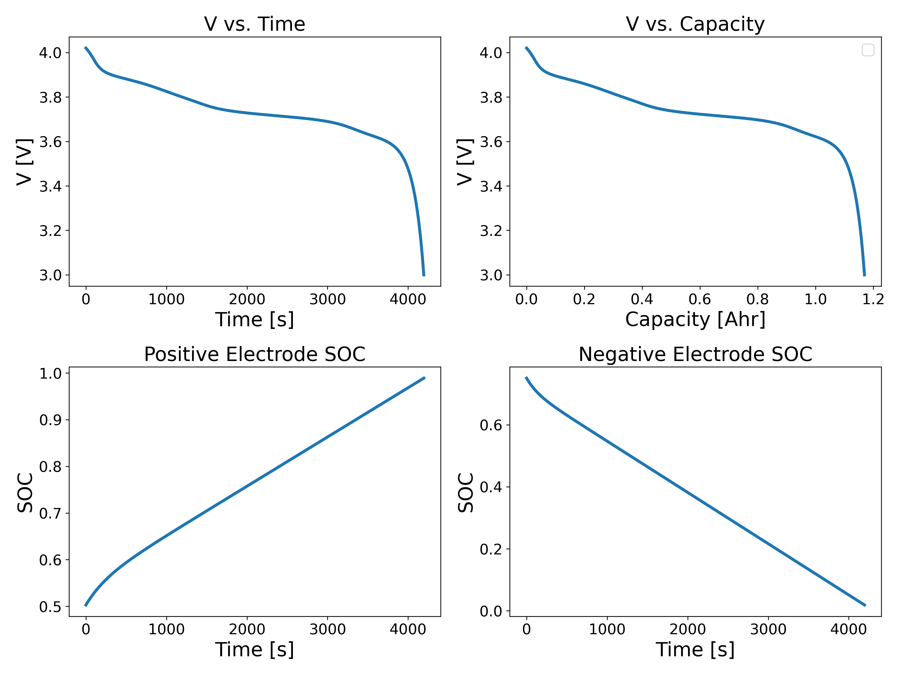

==================================================================
Example - Single Particle Model - Isothermal - Discharge Cycle
==================================================================
The simulation consists of creating a (1) battery cell, (2) cycler, and (3) solver object. For the battery cell object,
the parameters can be read from the parameter sets.

The following gives an example of running a single particle model under isothermal conditions using the parameter_set
named "Gao-Randall"::

    import SPPy
    </code>   

    # Define operating parameters  
    I = 1.656  
    T = 298.15  
    V_min = 3  
    SOC_min = 0.1  
    SOC_LIB = 0.9  
    </code> 

    # Define modelling parameters  
    SOC_init_p, SOC_init_n = 0.4956, 0.7568  # conditions in the literature source. Guo et al
    </code>  

    # Setup battery components  
    cell = SPPy.BatteryCell(parameter_set_name='test', SOC_init_p=SOC_init_p, SOC_init_n=SOC_init_n, T=T)
    </code> 

    # set-up cycler and solver  
    dc = SPPy.Discharge(discharge_current=I, V_min=V_min, SOC_LIB_min=SOC_min, SOC_LIB=SOC_LIB)  
    solver = SPPy.SPPySolver(b_cell=cell, N=5, isothermal=True, degradation=False, electrode_SOC_solver='poly')
    </code> 

The simulation will start once the ``solve`` method of the SPPySolver instance is called.
This method requires the cycler instance::

    # simulate
    sol = solver.solve(cycler_instance=dc)

The ``sol`` object stores various simulation results, including time, cell terminal voltage, electrode's lithium surface concentrations, etc.
Furthermore, it has plotting methods, for eg.,::

    # Plot  
    sol.comprehensive_isothermal_plot()

The following ``comprehensive_isothermal_plot()`` method outputs the following plot with the information on the cell
terminal potential during its discharge, as well the electrode's surface SOC.

.. toctree::
   :maxdepth: -1
   :caption: Contents:

