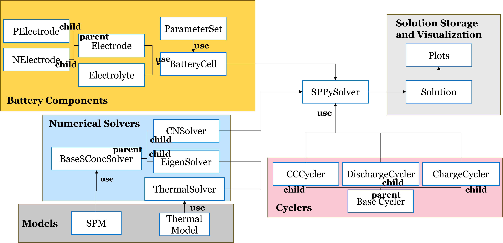

==============================================================================
Package Architecture
==============================================================================

This Python Package is written to ensure it is user-friendly, modularity, and flexibility.
User-friendly enables the user to write complex lithium-ion battery (LIB) complex simulation scripts
with the fewest lines of code, and the script structure is logically intuitive.
Modular code will allow for the expandability of the more electrochemical, thermal, and degradation models.
Unit tests are performed to test the functionalities of various functions and classes. However, the unit tests
are not discussed in this document, and the scripts for unit tests can be viewed under the test directories.
A flexible package structure will enable the user to quickly understand and change the various battery cell
and simulation parameters during usage.

Generally, various battery parameters must be stored, accessed, and modified during a simulation. Moreover,
model equations, along with the numerical solution schemes, need to be stored and utilized. Furthermore, t
he battery simulation will be run under some battery cycling conditions. For example, the battery cell simulation
will undergo a discharge, charge, or a combination of both. Also, the storage of simulated parameters, during and after
the simulation, and visualization of simulation results, after the simulation, will be needed. Class objects are
declared for the battery cell components, SPM model equations, numerical methods, cycling conditions,
simulation storage, and simulation visualization. A conceptual perspective of the class objects in unified
modeling language (UML) is depicted below (Figure 1).

    Conceptual Perspective of the Class Diagram in UML

.. toctree::
   :maxdepth: -1
   :caption: Contents: